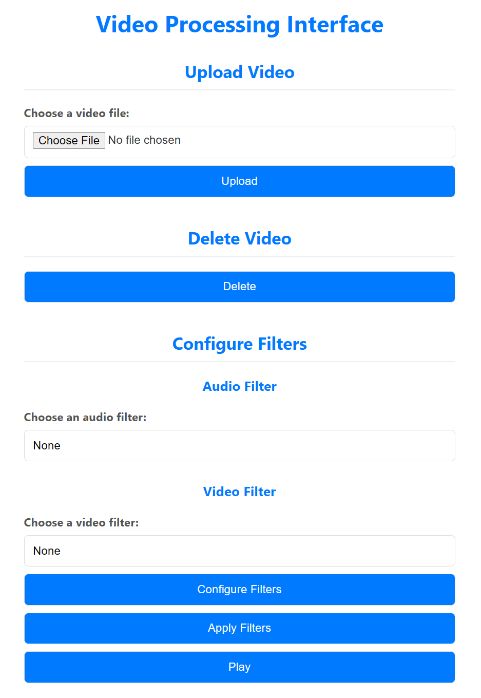
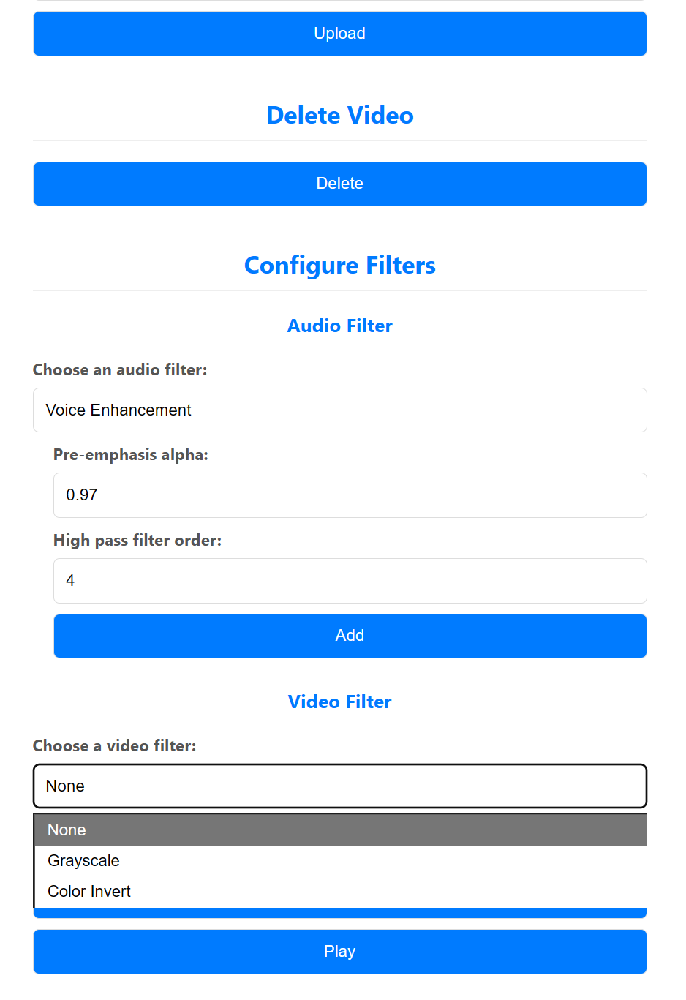
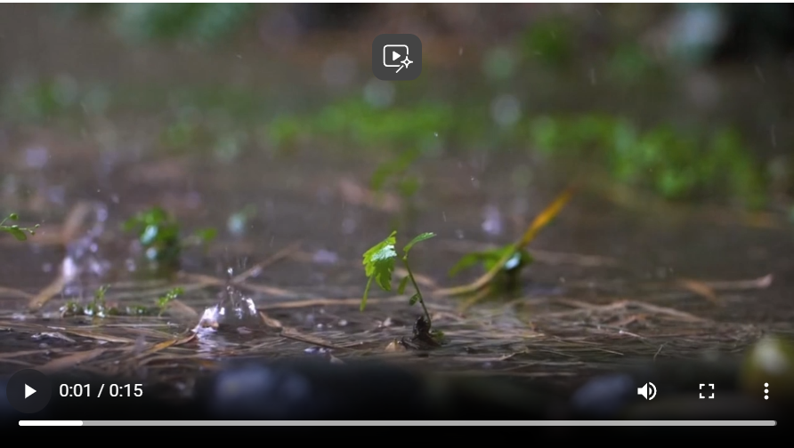
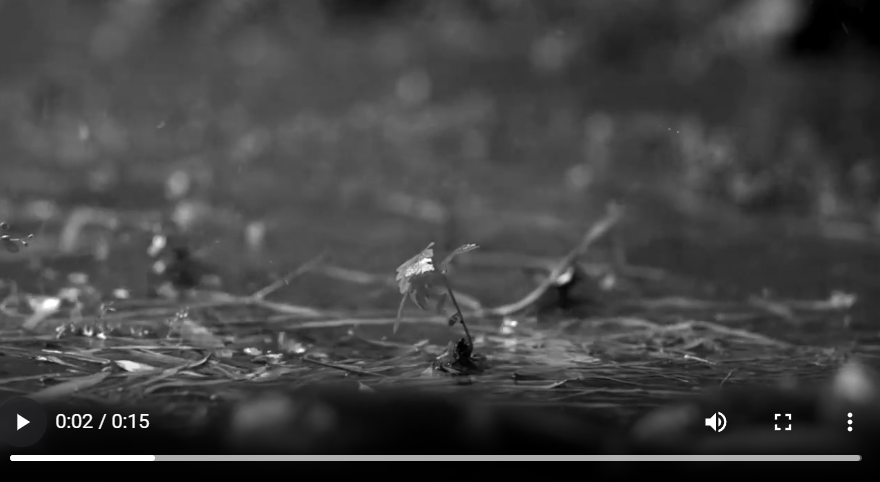

# 🎥 Flask Video Processing Interface

A web-based application for uploading, processing, and enhancing videos with customizable **audio** and **video filters**. Built with **Flask, FFmpeg, NumPy, and SciPy**, this project demonstrates the integration of digital signal processing (DSP) techniques into a user-friendly web interface.  

---

## 🚀 Features
- **Upload & Delete Videos** through a simple web interface  
- **Apply Video Filters**:  
  - Grayscale  
  - Color Inversion  
- **Apply Audio Filters**:  
  - Pre-emphasis  
  - Bandpass Filter (configurable cutoff frequencies and filter order)  
- **Real-time Processing** using FFmpeg and SciPy  
- **Stream Processed Videos** directly from the app  

---

## 🛠️ Tech Stack
- **Backend:** Flask, Python  
- **Frontend:** HTML, CSS (Jinja templates)  
- **Media Processing:** FFmpeg, NumPy, SciPy  
- **Other Tools:** Werkzeug, JSON  

---

## 📸 Screenshots  

### Main Interface  
  

### Video Upload & Filters  
  

### Original Video Preview  
  

### Processed Video Preview  
  

